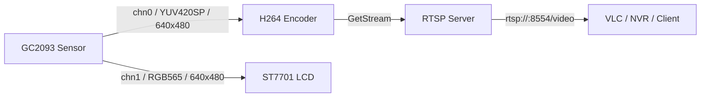
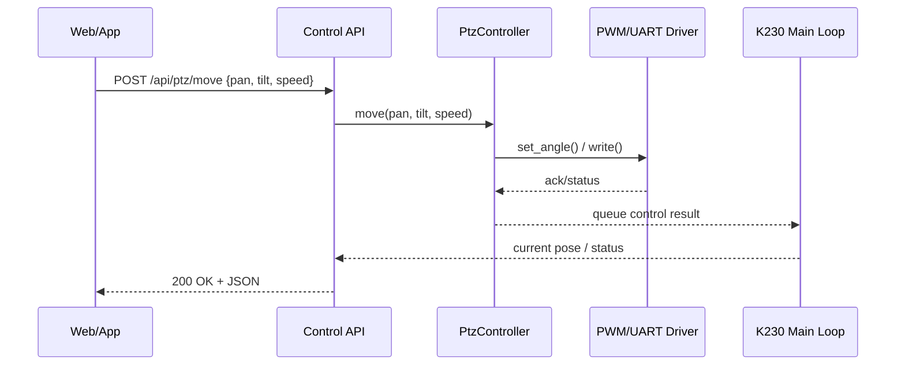

# k230-rtsp-display

## Executive Summary

这是一个基于 K230 与 CanMV MicroPython 的远程视频监控示例项目：摄像头双通道采集图像，`chn0` 输出 `YUV420SP` 供 H264 硬件编码并通过 RTSP 推流，`chn1` 输出 `RGB565` 供本地 LCD 实时显示；整个流程由 `Sensor`、`Display`、`MediaManager`、`Encoder` 与 `mm.rtsp_server()` 组成，当前精简版默认使用 `video` 会话名、`8554` 端口、`H264 Main Profile`、`640×480`、`15fps`、`1000 kbps`，适合作为 K230 本地显示 + 远程监看的起步模板。fileciteturn3file1L20-L27 fileciteturn3file1L60-L89 fileciteturn3file1L122-L154

## 项目简介

本项目实现了一个轻量级远程视频监控系统，核心目标是把 K230 板端摄像头画面同时送往两个方向：

- 一个方向走硬件编码链路，输出 RTSP 码流，供 VLC、NVR 或上位机客户端拉流。
- 另一个方向直接走 RGB 显示链路，在本地 LCD 上实时预览。fileciteturn3file1L67-L76 fileciteturn3file1L122-L154

当前代码已经具备完整的服务生命周期控制：初始化传感器、初始化显示、初始化媒体管理、创建编码器、启动 RTSP 会话、后台线程持续采集/编码/发送，退出时反初始化 `Sensor`、`Encoder`、`Display`、`MediaManager`。fileciteturn3file1L34-L58 fileciteturn3file1L60-L104

更早的实验入口文件还包含 Wi‑Fi 连接函数，以及一组面向 AI 扩展的依赖导入，例如 `nncase_runtime`、`aidemo`、`image`、`PipeLine`、`AIBase`、`Ai2d`，说明这个项目后续非常适合继续扩展为目标检测、事件识别或边缘 AI 监控系统。fileciteturn3file0L1-L22 fileciteturn3file0L26-L39

## 功能与架构

### 功能清单

- RTSP 视频推流，默认 H264、无音频。fileciteturn3file1L21-L27 fileciteturn3file1L34-L42
- LCD 本地显示，使用独立显示通道输出 `RGB565`。fileciteturn3file1L71-L76 fileciteturn3file1L132-L135
- 摄像头双通道采集：`chn0` 编码、`chn1` 显示。fileciteturn3file1L67-L76
- H264 硬件编码，使用 `Encoder()`、`SetOutBufs()`、`ChnAttrStr()`、`Create()`、`Start()` 完成配置。fileciteturn3file1L78-L93
- 软件组包发送 RTSP：`SendFrame()` → `GetStream()` → `rtspserver_sendvideodata()`。fileciteturn3file1L141-L154
- 后台线程持续工作，主循环只负责保活，不需要再次重复抓图显示。fileciteturn3file1L122-L157 fileciteturn3file1L169-L187

### 关键参数

下表按当前精简版脚本整理；另外，较早的实验版提供了较低码率、较低帧率的弱网络配置，可作为备用预设。fileciteturn3file1L14-L17 fileciteturn3file1L60-L89 fileciteturn3file0L105-L135

| 类别 | 参数 | 当前值 | 说明 |
|---|---|---:|---|
| RTSP | Session Name | `video` | 默认会话名 |
| RTSP | Port | `8554` | 默认 RTSP 端口 |
| 编码 | Codec | `H264` | 使用硬件编码 |
| 编码 | Profile | `Main` | `H264 Main Profile` |
| 编码 | Bitrate | `1000 kbps` | 当前精简版 |
| 编码 | FPS | `15` | `dst_frame_rate=15` / `src_frame_rate=15` |
| 编码 | Out Buffers | `8` | `SetOutBufs(..., 8, ...)` |
| 采集 | RTSP 分辨率 | `640 × 480` | RTSP 宽度会先做 16 对齐 |
| 显示 | LCD 分辨率 | `640 × 480` | 本地显示通道 |
| 通道映射 | `CAM_CHN_ID_0` | `YUV420SP` | 编码输入 |
| 通道映射 | `CAM_CHN_ID_1` | `RGB565` | 本地显示输入 |
| 备用预设 | Bitrate / FPS | `100 kbps / 5 fps` | 早期实验版，适合低带宽调试 |

### 数据流示意图

当前实现的数据流非常清晰：同一个传感器分出两条路径，一条给编码器和 RTSP，一条给 LCD 显示。fileciteturn3file1L67-L76 fileciteturn3file1L122-L154



## 硬件与软件环境

### 硬件清单

以下清单按当前项目代码与用户调试日志整理：

- K230 开发板
- GC2093 CSI2 摄像头
- ST7701 LCD 屏
- 可用的 Wi‑Fi 网络或与上位机同一局域网的网络环境
- 一台用于拉流/调试的电脑，建议安装 VLC

`Display.ST7701` 已在代码中直接使用，说明当前显示初始化目标为 ST7701。fileciteturn3file1L75-L76

### 软件 / 固件依赖与版本

以下环境信息适合作为 README 中的“推荐测试环境”填写：

```text
CanMV v1.3.5 (based on MicroPython e00a144)
Board: k230_canmv_yahboom
Sensor: gc2093_csi2
```

当前脚本依赖的核心 MicroPython / CanMV 模块包括：

- `multimedia as mm`
- `media.sensor`
- `media.display`
- `media.media`
- `media.vencoder`fileciteturn3file1L1-L11

如果你后续要增加 AI 功能，当前实验文件已经出现以下依赖，可作为扩展方向参考：

- `nncase_runtime`
- `aidemo`
- `image`
- `libs.PipeLine`
- `libs.AIBase`
- `libs.AI2D`fileciteturn3file0L10-L22

## 快速开始

### 克隆仓库

```bash
git clone https://github.com/<your-username>/k230-rtsp-display.git
cd k230-rtsp-display
```

### 推荐仓库组织方式

为了便于维护，建议把你当前的两份脚本整理为下面这种结构：

```text
k230-rtsp-display/
├── README.md
├── LICENSE
├── main.py
├── rtsp_display_server.py
└── docs/
    └── troubleshooting.md
```

当前两份已提供脚本分别对应“带 Wi‑Fi 入口的实验版”和“聚焦 RTSP + LCD 的精简版”。fileciteturn3file0L26-L39 fileciteturn3file0L228-L250 fileciteturn3file1L20-L58

### 配置

如果你采用带 Wi‑Fi 的入口脚本，建议把 SSID/密码改为环境变量、配置文件或单独的 `config.py`，不要把明文凭据直接提交到仓库。原始连接逻辑基于 `network.WLAN(0)`，连接成功后会打印板子的实际 IP。fileciteturn3file0L26-L39

推荐在入口文件里这样写：

```python
from config import WIFI_SSID, WIFI_PASSWORD
is_connected = Connect_WIFI(WIFI_SSID, WIFI_PASSWORD)
```

RTSP 的默认会话名和端口分别是 `video` 与 `8554`；如果你要在同一板上扩展多路流，建议把它们提取成配置项。fileciteturn3file1L21-L27

### 烧录固件

本 README 默认你已经为开发板刷入 CanMV v1.3.5。烧录完成后，建议先通过串口或 IDE 确认下面的信息：

```text
CanMV v1.3.5(based on Micropython e00a144) on 2025-06-30; k230_canmv_yahboom with K230
find sensor gc2093_csi2, type 9, output 1920x1080@60
```

### 上传并运行

如果你把精简版保存为 `main.py`，上电后可自动运行；如果只是临时测试，也可以在 REPL 中执行：

```python
exec(open("main.py").read())
```

当前精简版在 `rtspserver.start()` 之后会打印 RTSP 地址，并把主线程保持在一个只做 `os.exitpoint()` 与 `sleep` 的循环里。fileciteturn3file1L169-L187

### 拉流测试

在 PC 端使用 VLC 拉流时，请使用开发板的**实际 IP**，不要直接照抄 `0.0.0.0`。例如：

```text
rtsp://192.168.1.123:8554/video
```

项目中能够获取 RTSP 路径的 API 是 `rtspserver_getrtspurl(self.session_name)`；如果你使用带 Wi‑Fi 的入口脚本，板子还会在联网后打印实际 IP。fileciteturn3file1L57-L58 fileciteturn3file0L26-L39

> 使用注意：当前精简版已经在后台线程中执行 `snapshot()` 与 `Display.show_image()`，主循环不要再额外重复抓图和显示，否则容易引入竞争或花屏。fileciteturn3file1L122-L157 fileciteturn3file1L174-L176

## 代码结构与关键初始化顺序

### 文件 / 模块说明

下表是推荐的仓库命名方式，便于直接放到 GitHub。fileciteturn3file0L43-L93 fileciteturn3file1L20-L58

| 建议文件名 | 作用 | 对应现有内容 |
|---|---|---|
| `main.py` | 项目入口，负责启动服务、可选连接 Wi‑Fi、打印 RTSP 地址 | 适合由 `Pasted code(3).py` 整理而来 |
| `rtsp_display_server.py` | `RtspDisplayServer` 核心类，负责 `_init_stream()`、`_start_stream()`、`_do_rtsp_stream()`、`_stop_stream()` | 适合由“精简版 RTSP + LCD 文件”整理而来 |
| `config.py` | Wi‑Fi、显示参数、RTSP 参数等配置项 | 建议新增 |
| `LICENSE` | 开源协议 | 建议新增 |
| `docs/troubleshooting.md` | 常见问题和日志排查 | 建议新增 |

### 推荐初始化顺序

当前项目的工作链路对初始化顺序比较敏感。建议保持如下顺序：

1. `Sensor()` / `reset()`
2. 配置 `chn0` 为 `YUV420SP`
3. 配置 `chn1` 为 `RGB565`
4. `Display.init(...)`
5. `MediaManager.init()`
6. `Encoder()`
7. `SetOutBufs(...)`
8. `Create(...)`
9. `rtspserver_init(...)` / `createsession(...)` / `rtspserver_start()`
10. `Encoder.Start(...)`
11. `sensor.run()`
12. 后台线程循环中：`snapshot()` → `Display.show_image()` → `SendFrame()` → `GetStream()` → `rtspserver_sendvideodata()` → `ReleaseStream()`fileciteturn3file1L34-L42 fileciteturn3file1L60-L104 fileciteturn3file1L122-L154

### 示例代码片段

下面这段可以直接放到 README 中，帮助使用者理解关键初始化顺序：

```python
def _init_stream(self):
    rtsp_width = ALIGN_UP(RTSP_WIDTH, 16)
    rtsp_height = RTSP_HEIGHT

    self.sensor = Sensor()
    self.sensor.reset()

    # chn0 -> RTSP / Encoder
    self.sensor.set_framesize(width=rtsp_width, height=rtsp_height, alignment=12, chn=CAM_CHN_ID_0)
    self.sensor.set_pixformat(Sensor.YUV420SP, chn=CAM_CHN_ID_0)

    # chn1 -> Local LCD
    self.sensor.set_framesize(width=DISPLAY_WIDTH, height=DISPLAY_HEIGHT, chn=CAM_CHN_ID_1)
    self.sensor.set_pixformat(Sensor.RGB565, chn=CAM_CHN_ID_1)

    Display.init(Display.ST7701, width=DISPLAY_WIDTH, height=DISPLAY_HEIGHT, to_ide=True)
    MediaManager.init()

    self.encoder = Encoder()
    self.encoder.SetOutBufs(self.venc_chn, 8, rtsp_width, rtsp_height)

    chn_attr = ChnAttrStr(
        self.encoder.PAYLOAD_TYPE_H264,
        self.encoder.H264_PROFILE_MAIN,
        rtsp_width,
        rtsp_height,
        bit_rate=1000,
        dst_frame_rate=15,
        src_frame_rate=15,
    )
    self.encoder.Create(self.venc_chn, chn_attr)
```

这段逻辑来自当前精简版实现；在 `_start_stream()` 中再执行 `self.encoder.Start(...)` 与 `self.sensor.run()`。fileciteturn3file1L60-L93

### 关闭顺序

为了避免资源泄漏，停止时建议严格按“先停采集，再停编码，再反初始化显示与媒体管理”的思路执行。当前精简版的释放顺序如下：`sensor.stop()` → `encoder.Stop()` → `encoder.Destroy()` → `Display.deinit()` → `MediaManager.deinit()`。fileciteturn3file1L95-L104

## 常见错误与调试建议

### 常见错误与排查

| 日志匹配 | 常见原因 | 处理建议 |
|---|---|---|
| `Exception please run MediaManager._config() before MediaManager.init()` | 初始化顺序被改乱，或上一次异常退出后媒体状态未清干净 | 先恢复到 README 中列出的已验证顺序；不要随意把 `Create()`、`Start()`、`MediaManager.init()` 的先后关系改来改去；必要时完整重启板子 |
| `RuntimeError: MediaManager, vb config failed(...)` | VB 缓冲池状态异常，通常是上一次异常退出后只做了 soft reboot | 不要只依赖 `MPY: soft reboot`；请按 Reset 或断电重启开发板，再重新运行；确认退出路径真正执行了 `Display.deinit()` 与 `MediaManager.deinit()` |
| `Exception mpi venc get stream failed.` | 编码器还没来得及产出码流，或 `GetStream()` 调用过早 | 先确认 `rtsp_img != -1`；可在 `SendFrame()` 与 `GetStream()` 之间加 `time.sleep_ms(1)`；必要时捕获异常后 `continue` 重试 |
| 屏幕黑屏，但代码里有 `Display.show_image(display_img)` | 显示模型不匹配、`to_ide=True` 只送 IDE 预览、或者显示线程没跑起来 | 先确认 `display_img` 已经不是 `-1`；尝试把 `to_ide=True` 改为 `False`；确认屏幕型号是否就是 `ST7701` |
| `rtsp://0.0.0.0:8554/video` 能打印，但 VLC 拉不到流 | `0.0.0.0` 是监听地址，不是客户端访问地址 | 用板子的实际 IP 代替 `0.0.0.0`，例如 `rtsp://192.168.1.123:8554/video` |

当前循环中的关键观察点包括：`display_img` 是否有效、`rtsp_img` 是否有效、`GetStream()` 是否稳定返回、`fps` 是否持续打印。fileciteturn3file1L132-L157

### 示例日志匹配

以下是开发中非常有代表性的几类日志，建议直接保留到 `docs/troubleshooting.md` 里：

```text
Exception please run MediaManager._config() before MediaManager.init()
```

```text
RuntimeError: MediaManager, vb config failed(-1610317806), at now please reboot the board to fix it.
```

```text
Exception mpi venc get stream failed.
```

```text
display_img = {"w":640, "h":480, "type":"rgb565", "size":614400}
```

```text
rtsp server start: rtsp://0.0.0.0:8554/video
```

其中，`display_img = {"w":640, "h":480, "type":"rgb565", ...}` 往往说明 `chn1` 显示通道取图成功，此时优先排查显示初始化或编码链路，而不是怀疑摄像头根本没出图。

### 调试建议

#### 打印建议

当前精简版已经自带两处非常有用的调试输出：

- `print("display_img =", display_img)`：确认显示通道取图是否成功
- `print("fps:", fps.fps())`：观察线程是否仍在稳定运行fileciteturn3file1L136-L137 fileciteturn3file1L154-L155

如果你要继续增强日志，建议新增以下打印点：

```python
print("rtsp_img =", rtsp_img)
print("send frame ok")
print("get stream ok, pack_cnt =", stream_data.pack_cnt)
```

#### 如何单独测试 LCD

如果你怀疑 LCD 路径有问题，先不要运行整个 RTSP 项目，单独测试显示链路：

```python
import time
import os
from media.sensor import *
from media.display import *
from media.media import *

sensor = Sensor()
sensor.reset()

sensor.set_framesize(width=640, height=480, chn=CAM_CHN_ID_1)
sensor.set_pixformat(Sensor.RGB565, chn=CAM_CHN_ID_1)

Display.init(Display.ST7701, width=640, height=480, to_ide=False)
MediaManager.init()
sensor.run()

while True:
    os.exitpoint()
    img = sensor.snapshot(chn=CAM_CHN_ID_1)
    if img != -1:
        Display.show_image(img)
    time.sleep_ms(10)
```

这个最小例子的依据是：当前项目就是把 `chn1` 配成 `RGB565` 后送到 `Display.show_image()`。fileciteturn3file1L71-L76 fileciteturn3file1L132-L135

#### 如何确认 RTSP 地址

当前服务类通过 `get_rtsp_url()` 返回 RTSP 地址；如果你使用带 Wi‑Fi 的入口脚本，联网成功后还会打印 `sta.ifconfig()[0]`。因此，最可靠的方法是：

1. 先记下开发板打印出来的实际 IP；
2. 再用 `rtsp://<board-ip>:8554/video` 在 VLC 中打开。fileciteturn3file1L57-L58 fileciteturn3file0L26-L39

#### 关于 `GetStream()` 等待时间

某些固件/运行时组合下，`SendFrame()` 后立即 `GetStream()` 可能会偶发失败。当前代码是连续调用：

```python
self.encoder.SendFrame(self.venc_chn, frame_info)
self.encoder.GetStream(self.venc_chn, stream_data)
```

这正是你排查 `mpi venc get stream failed` 时应重点关注的位置。必要时可以在两者之间增加一个 1~5 ms 的等待，或者把 `GetStream()` 包进 `try/except` 后重试。fileciteturn3file1L141-L154

## 后续扩展、贡献与许可

### 后续扩展方向

更早的实验文件已经引入了 AI 相关依赖，这意味着你可以很自然地把当前仓库扩展为“视频监控 + AI 分析 + 云台控制”的完整项目。fileciteturn3file0L10-L22

推荐的后续模块拆分方式如下：

| 模块 | 建议职责 |
|---|---|
| `core/rtsp_display.py` | 维护当前 RTSP + LCD 主链路 |
| `vision/detector.py` | AI 检测、框选、事件分类 |
| `vision/overlay.py` | 把识别结果绘制到显示或编码前图像 |
| `ptz/controller.py` | 云台抽象控制器 |
| `ptz/driver_pwm.py` | PWM 舵机驱动 |
| `ptz/driver_uart.py` | 串口云台驱动 |
| `api/server.py` | HTTP / WebSocket 控制接口 |
| `config.py` | 板级参数、网络、串口、舵机限位等配置 |

### 云台接口 / 模块设计建议

建议把云台控制写成独立抽象层，不要把舵机细节直接耦合到视频线程里。推荐的 Python API 约定如下：

```python
class PtzController:
    def move(self, pan: int, tilt: int, speed: int = 50, block: bool = False) -> dict:
        ...

    def center(self) -> dict:
        ...

    def stop(self) -> dict:
        ...

    def get_status(self) -> dict:
        ...
```

推荐返回统一数据结构：

```python
{
    "ok": True,
    "pan": 0,
    "tilt": 0,
    "speed": 50,
    "timestamp_ms": 0,
    "message": "moved"
}
```

如果后面加 Web API，建议约定如下：

- `POST /api/ptz/move`
- `POST /api/ptz/center`
- `POST /api/ptz/stop`
- `GET /api/ptz/status`

### 数据流与控制流示意图



### 贡献指南

欢迎提交 Issue 和 Pull Request。建议遵循下面的最小流程：

1. 新建分支，例如 `feature/ptz-control`
2. 保持每次提交只解决一个问题
3. 对涉及板端资源释放的改动，务必补充“异常退出后的恢复说明”
4. 提交 PR 时附上：
   - 使用的固件版本
   - 板卡型号
   - 关键启动日志
   - 复现步骤
   - 是否需要硬重启恢复

欢迎交流：RTSP / K230 / CanMV / GC2093 / ST7701 / 边缘 AI / 云台控制
```
